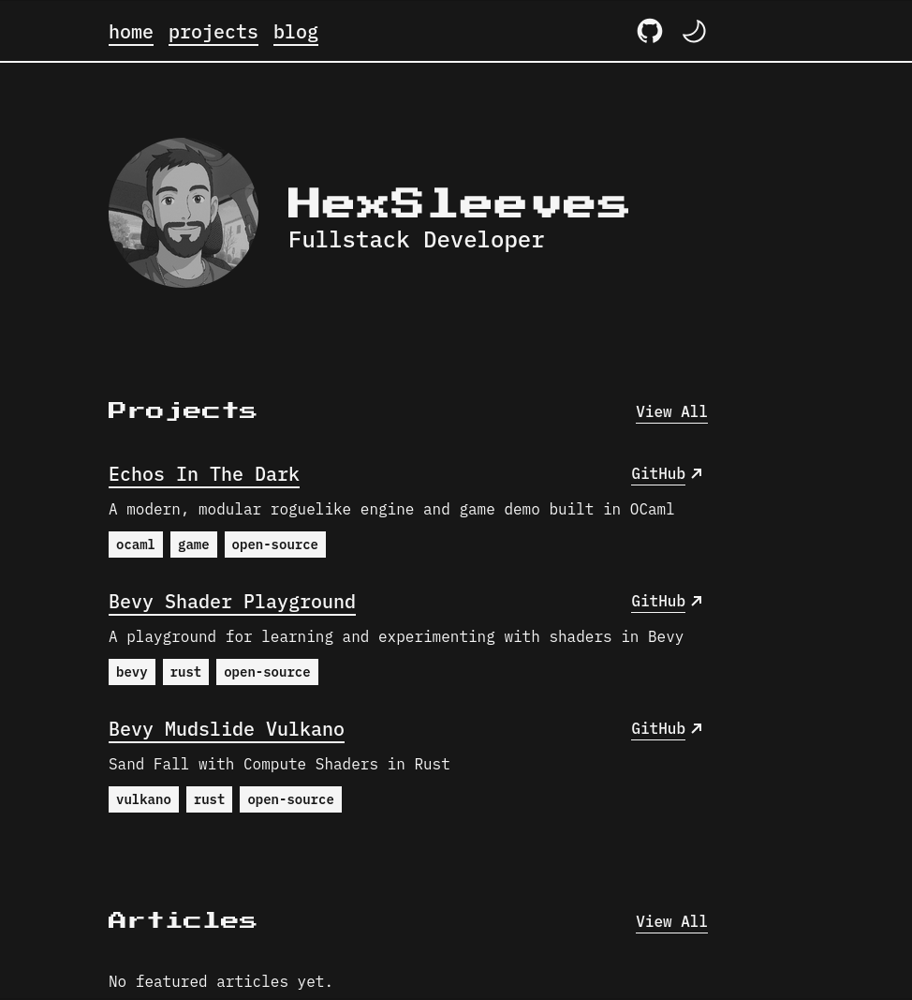

<p align="center">
  
</p>

# Jacob LeCoq's Personal Website & Blog

Welcome! This is my personal website and blog, built with [Astro](https://astro.build/) and styled using a retro-inspired Zaggonaut theme. Here, I share my projects, articles, and thoughts on web development, tech, and more.

**Live site:** [astro-personal-75h4bqxsm-jacob-lecoqs-projects.vercel.app](https://astro-personal-75h4bqxsm-jacob-lecoqs-projects.vercel.app/)

---

## Features

- ✨ Retro-inspired, fully responsive design
- 🌗 Dark & light mode
- 🎨 Easily customizable colors and text
- 🧑‍💻 TypeScript & TailwindCSS
- 🏆 100/100 Lighthouse score
- ♿ Accessible and SEO-friendly
- 📝 Blog and project sections

---

## Getting Started

### 1. Clone the Repository

```bash
git clone https://github.com/your-username/astro-personal.git
cd astro-personal
```

### 2. Install Dependencies

> **Note:** This project uses `bun` for package management.

```bash
bun install
```

### 3. Run the Development Server

```bash
bun dev
```

Visit [localhost:4321](http://localhost:4321) to view your site locally.

---

## Customization

### Site Metadata & Text

All site metadata (name, social links, descriptions, menu, etc.) is managed in [`src/lib/variables.ts`](src/lib/variables.ts).
Update this file to personalize your username, profile image, social links, blog/project titles, and more.

```typescript
export const GLOBAL = {
  username: "HexSleeves",
  rootUrl: "https://hex-sleeves.dev",
  shortDescription: "Fullstack Developer",
  // ...more fields
};
```

### Colors & Theme

Colors are managed via CSS variables in [`src/styles/global.css`](src/styles/global.css).
You can adjust the following variables to match your style:

- `--color-zag-dark`
- `--color-zag-light`
- `--color-zag-dark-muted`
- `--color-zag-light-muted`
- `--color-zag-accent-light`
- `--color-zag-accent-light-muted`
- `--color-zag-accent-dark`
- `--color-zag-accent-dark-muted`

These are set using Tailwind's color palette, but you can override them for a unique look.

---

## Project Structure

- `src/pages/` — Main site pages (`/`, `/blog`, `/projects`)
- `src/components/` — Reusable UI components
- `src/lib/variables.ts` — Site-wide text and metadata
- `src/styles/global.css` — Global styles and theme variables

---

## Deployment

This site is deployed on [Vercel](https://vercel.com/).
You can deploy your own fork by connecting your repo to Vercel and following their setup instructions.

---

## License

MIT

---

## Credits

- [Astro](https://astro.build/)
- [Zaggonaut Theme](https://github.com/RATIU5/zaggonaut) (used as a base and customized for this site)

---

Let me know if you want to further personalize or add sections (e.g., contributing, FAQ, etc.)!
